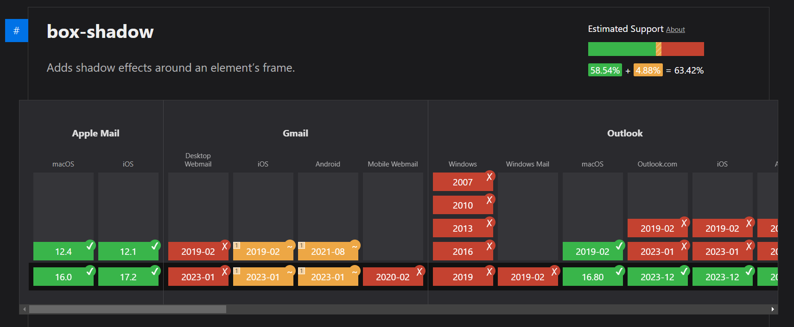

# Introduction

### Overview

`@inboxartisan/components` is a collection of reusable, thematic components for building email templates. It is built on top of [react.email](https://react.email), which offers a collection of unstyled components that work across multiple email clients.

While [react.email](https://react.email) provides a method [\[1\]](./#references) that converts a React component into an HTML file, not all CSS properties and HTML elements are supported by major email clients. This means typical component libraries like Material-UI (MUI) and Chakra UI cannot be used directly for creating email templates, as it might lead to inconsistencies across various email clients.

`@inboxartisan/components` solves this problem by providing you with MUI-like (Material-UI-like) thematic mail components that can work consistently across most (>=90%) of the email clients. We also allow you to export your email components in various forms, making it super easy to integrate them with your existing email service providers (ESPs) or email workflows.

### Mail Clients vs Web Browsers

> Think of mail clients like outdated web browsers, which only support a limited number of HTML elements and CSS properties.

Here's a simple example of a CSS property that works on most web browsers, but won't work on most email clients: A common way to add elevation to a container component (e.g., `
`) is by using a CSS property called `box-shadow`. As of April 2024, only 58.4% of all significant email clients fully support this property. Another common example is `display: grid;`. It is a property that is widely supported by most web browsers, but it is only supported by 60.98% of all significant email clients. [\[3\]](./#references).

Keeping track of which CSS properties or HTML elements can be used while building mail templates can give you a migraine & this is a problem that we're trying to solve.

<figure><figcaption></figcaption></figure>

### Limited Components

`@inboxartisan/components` will be offering a collection of 18 components, which is not a lot, especially in comparison to modern component libraries like MUI or Chakra UI. There are two reasons why:

1. **Limited support:** As mentioned above, most email clients only support a limited number of HTML elements and CSS properties. This means that it wouldn't be feasible to render many HTML elements with low support in several email clients. For example, the form element `<input type="text" />` is used in all web apps, but its full support is estimated to be only 43.9% among email clients. [\[4\]](./#references).
2. **Intentional limitation:** Just because a particular HTML element or CSS property is supported by a certain email client doesn't necessarily mean that it should be used in an email template, as it may still render inconsistently or cause compatibility issues across different email clients and environments. For example, unless scripts can be executed within emails, it does not make sense to have form components e.g. input field, checkbox, etc.

### A Rant

If you believe that despite all the improvements in mail clients, the following mail template is "okay" just because it gets the job done, then you should also be okay with web 1.0 style web apps. The whole point of this is to make beautiful and modern mail templates.

<figure><figcaption>
Default mail template for Firebase authentication
</figcaption></figure>

### References

\[1] Render utility (react.email): [https://react.email/docs/utilities/render](https://react.email/docs/utilities/render)

\[2] `box-shadow` (caniemail.com): [https://www.caniemail.com/features/css-box-shadow/](https://www.caniemail.com/features/css-box-shadow/)

\[3] `display: grid;` (caniemail.com): [https://www.caniemail.com/features/css-display-grid/](https://www.caniemail.com/features/css-display-grid/)

\[4] `<input type="text"/>` (caniemail.com): [https://www.caniemail.com/features/html-input-text/](https://www.caniemail.com/features/html-input-text/)
